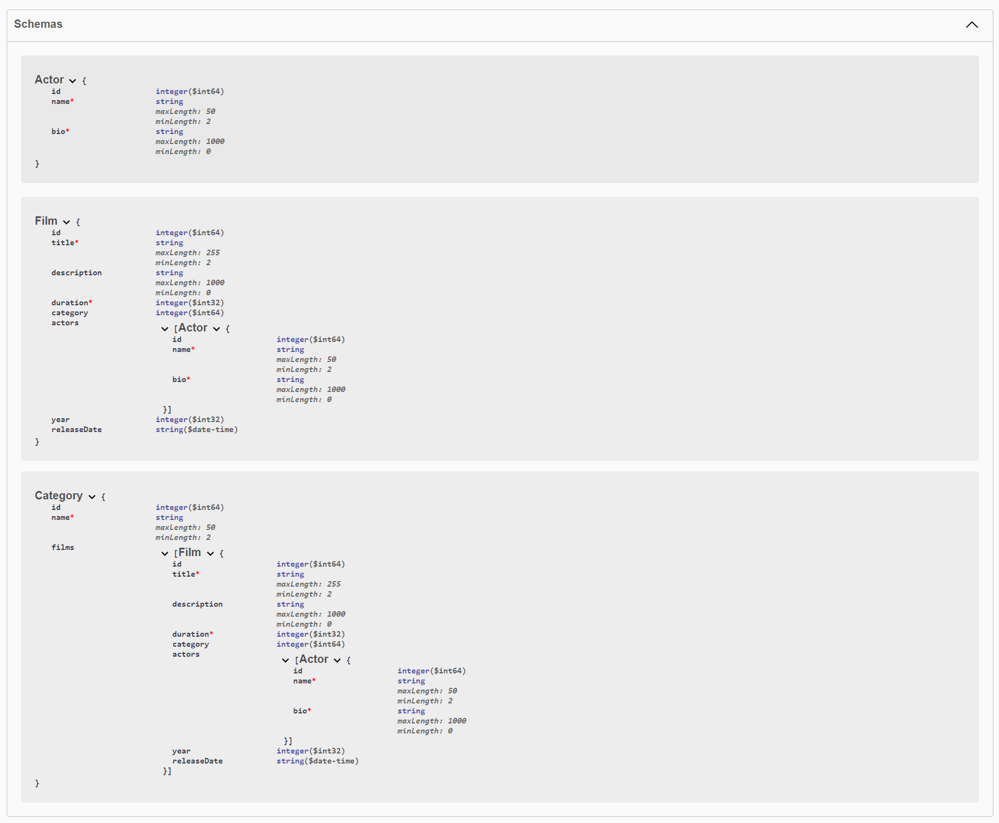

# REST API for Video Library Management 
This is a Spring Boot REST API designed to manage a video library. It allows users to perform CRUD operations (Create, Read, Update, Delete) on actors, categories, and films. 
The project uses Spring Data JPA to manage data with an H2 in-memory database. It also includes Swagger for testing and documentation, along with unit testing using JUnit.

## Overview :
The application provides a set of API endpoints for managing a video library database. Users can add, retrieve, update, and delete records for actors, categories, and films. 

## API Endpoints :
### Actors :
- `GET /actors`: Retrieve a list of all actors.
- `GET /actors/{id}`: Get details of a specific actor by ID.
- `POST /actors`: Add a new actor to the database.
- `PUT /actors/{id}`: Update an existing actor's information.
- `DELETE /actors/{id}`: Delete an actor by ID.
### Categories :
- `GET /categories`: Retrieve all categories.
- `GET /categories/{id}`: Get a specific category by ID.
- `POST /categories`: Create a new category.
- `PUT /categories/{id}`: Update an existing category.
- `DELETE /categories/{id}`: Delete a category by ID.
### Films
- `GET /films`: Retrieve all films.
- `GET /films/{id}`: Get a specific film by ID.
- `POST /films`: Add a new film to the database.
- `PUT /films/{id}`: Update an existing film's details.
- `DELETE /films/{id}`: Remove a film from the database.

## H2 In-Memory Database :
The project uses an **H2 in-memory database**, which means that the data is temporary and will reset every time the application is restarted.
The database schema and initial data are defined in the `schema.sql` and `data.sql` files.

You can access the H2 database console to view and manipulate data via:
- `http://localhost:8080/h2-console`

## JDBC URL: jdbc:h2:mem:testdb
- Username: sa
- Password: (leave blank)

## Swagger UI for API Testing :
Swagger is integrated to provide easy-to-use API testing and documentation. Once the application is running, you can access the Swagger interface at:
- `http://localhost:8080/swagger-ui/index.html`
  
Using Swagger, you can interact with the API, view the available endpoints, and execute test requests directly from the browser.
Alternatively, you can use Postman for testing the API. Just set up your requests with the available API endpoints mentioned above.

## Project Structure
- **Controllers**: Manage the HTTP requests and responses.
- **Services**: Contain the business logic and interact with the repositories.
- **Repositories**: Handle database operations using Spring Data JPA.
- **Models**: Define the entities for actors, categories, and films.

## Database Schema Overview :
Here’s a visual overview of the database schema, showing the relationships between actors, categories, and films:

